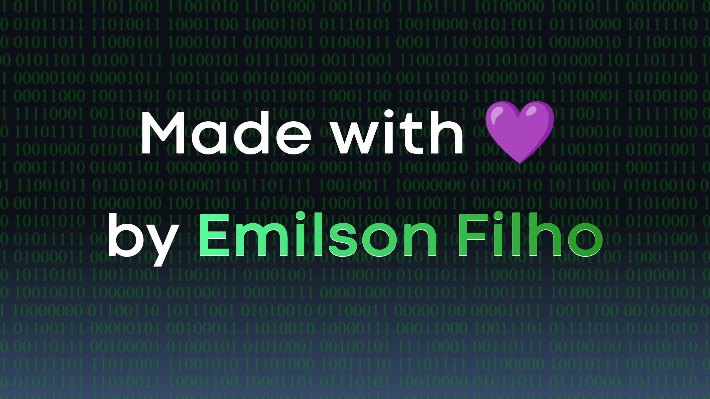

🇧🇷 - Esse site foi mais uma espécie de *exercício* do que **realmente** um mini-projeto de site. 

🇺🇸 - (*This site was more of a *exercise* of sorts than **really** a mini-site project.*)

## Contexto (*Context*) 🌱

🇧🇷 - Eu estava estudando no [CursoEmVideo](https://www.cursoemvideo.com/) e, no módulo 4 de HTML e CSS, foi-me apresentado o conteúdo de iframes, e dentro de uma das aulas lançadas, eu me lembro que teve um conteúdo sobre exibição de páginas dentro desses mesmos iframes, então eu pensei: “Por que não criar um site onde haja um iframe e 6 cores, e cada vez que a pessoa clicar em um, o iframe automaticamente será preenchido?”  

🇺🇸 - (*I was studying at [CursoEmVideo](https://www.cursoemvideo.com/) and, in module 4 of HTML and CSS, I was presented with the content of iframes, and within one of the lessons, I remember there was content about displaying pages within these same iframes, so I thought: “Why not creating a site where there'll be an iframe and 6 colors, and each time the user clicks on one, the iframe will automatically be filled?”*)

🇧🇷 - A ideia estava pronta, então só me restava pôr a mão na massa. 

🇺🇸 - (*The idea was ready, so I just had to get my hands-on*)

🇧🇷 - Acontece que, na empolgação de escrever essas linhas de código, as cores me fizeram lembrar da bandeira LGBT, e foi aí que eu me lembrei que estamos no *Pride Month* (Hoje é 12 de Junho de 2022) e então pensei em dar uma pesquisada para saber o significado de cada cor. 

🇺🇸 - (*Turns out, in the excitement of writing these lines of code, the colors reminded me of the LGBT flag, and that's when I remembered that it's Pride Month (Today's June 12th, 2022) and I thought about searching to know the what each color means.*)

## Dificuldades (*Difficulties*) 🤯

### 1. Iniciante no inglês (*Beginner in English*) 

🇧🇷 - Essa foi uma das mais incríveis dificuldades que tive porque, como estudante de uma língua diferente da minha originária, era uma oportunidade de aumentar ainda mas o meu vocabulário e meu nível de gramática nessa língua. 

🇺🇸 - (*This was one of the most incredible difficulties I had 'cause, as a student of a language different from my native language, it was an opportunity to increase even more my vocabulary and my knowledge in this language*)

### 2. Pesquisas (*Researches*)

🇧🇷 - Por incrível que pareça, eu não sabia o significado das cores da bandeira, então precisei de uns minutinhos para saber tudo. 

🇺🇸 - (*As incredible as it may seem, I didn't know what each one of the colors meant, so I needed a few minutes to get to know 'em all.*)

### 3. Ausência de computador (*Absence of computer*)

🇧🇷 - É, por mais maçante que seja, eu ainda não possuo um computador e precisei codificar tudo no celular. Espero que a resolução em computadores não seja ruim. 

🇺🇸 - (*Yeah, as boring as it sounds, I still don't have a computer and I needed to encode everything on a cellphone. I hope the resolution isn't awful.*)

### 4. Editor de código (*Code editor*)

🇧🇷 - Meu editor de código (TrebEdit) infelizmente não possui compatibilidade com a atividade que eu estava exercendo, o que me fez ficar um tanto mais triste ao perceber que eu teria que codificar tudo no celular (por incrível que pareça, o tablet não consegue abrir arquivos HTML da memória no Chrome).

 

<em>🇺🇸 - [My code editor (TrebEdit) unfortunately doesn't have compatibility with the interaction I was exercising, what made me stay a little sad when I noticed l'd have encoding everything on cellphone (as incredible as it may seem, my tablet can't open an HTML archive from the memory on Chrome)].</em>

## Conquistas (*Achievements*) 🥇

1. 🇧🇷 - Esse foi meu primeiro site inteiramente em inglês (até mesmo os códigos CSS foram dados nesse idioma) 🇺🇸 - [*This was my first site entirely in English (even the CSS code was written in this language).*]

2. 🇧🇷 - Também foi a primeira vez usando [Bootstrap](https://getbootstrap.com/) no código sem ser em um computador.  🇺🇸 - (*Moreover, this was the first time I had used the [Bootstrap](https://getbootstrap.com/) code without being on a computer*)

## Conhecimentos Adquiridos (*Acquired Knowledge*) 📚

🇧🇷 - Aprendi a fazer o efeito espelho de vidro (*Glassmorphism*) em CSS com créditos totais ao [OneBitCode](https://instagram.com/onebitcode?igshid=YmMyMTA2M2Y=) que fez um post no [Instagram](https://www.instagram.com/) sobre esse efeito. Obrigado, OneBitCode! ❤️ 

🇺🇸 - (*I learned to make the glassmorphism CSS effect with full credits to OneBitCode who did an Instagram post about this effect. Thank u, OneBitCode!*) ❤️

🇧🇷 - Obrigado também ao [Guanabara](https://github.com/gustavoguanabara) pelo conteúdo incrível que vem trazendo no YouTube. 🖖 

🇺🇸 - (*Thnks also 2 [Guanabara](https://github.com/gustavoguanabara), for the incredible contente that you'd brought on YouTube.*) 🖖

